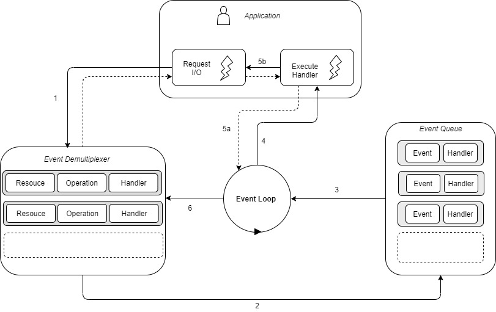

# Event De-multiplexing
As busy-waiting is not an ideal solution for non-blocking resources. `Modern OS` provide a `native mechanism` to handle concurrent `non-blocking resources` in an `efficient way` that is `synchronous event de-multiplexing` (also know as `event notification interface`)

```javascript
watchedList.add(socketA, FOR_READ);
watchedList.add(SocketB, FOR_WRITE);
watchedList.add(fileA, FOR_READ);
while(events = deMultiplexer.watch(watchedList)) {
  // event loop
  for(event of events){
    // This read will never block and will always return data
    data = event.resource.read();
    if(data === RESOURCE_CLOSED) {
      // the resource was closed, remove it from the watched list
      deMultiplexer.unWatch(event.resource);
    } else {
      // Some actual data was received, process it
      consumeData(data)
    }
  }
}
```
Let us see what happens in the above pseudo code
- The `resources are added to the data structure `(`watchedList)`, associating each one of them a `specific operation (FOR_READ, FOR_WRITE)`.
- The de-multiplexer is setup with the group of `resources to be watched`. `deMultiplexer.watch() is a synchronous and blocked until any of the watched resources are ready for read`. When this occurs, the event de-multiplexer returns from the call and new set of `event are available to be processed`.
- Each event returned by the event de-multiplexer is processed. `At this point, the resources associated with each event is guaranteed to be ready to read to not blocking during the operation`. When `all the events are processed, the flow will block again` on the event de-multiplexer `until new event are again available to be processed`, `this is called the event loop`.

It's interesting to see that, with this pattern, we can handle several I/O operation on single thread, without using busy-waiting technique.

The tasks are spread over time, instead of being spread across multiple threads. This has the clear advantage of minimizing the total idle time of the thread.

Having single thread also has a beneficial impact on the way programmers approach concurrency in general. The absence of in-process race condition and multiple threads to synchronized allows us to use much simpler concurrency strategies. '

# **`The reactor pattern`**
The main idea behind the reactor pattern is to have a handler associated with each I/O operation. the handler in Node.js is represented by callback (or cb for short) function. 

The Handler will be invoked as soon as an event is produced and processed by the event loop. the structure of the reactor pattern is shown in below.



This is what happens in an application using he reactor pattern:
- The application generates a new I/O operation by submitting a request to the Event De-multiplexer. The application also specifies a handler, which will be invoked when the operation completes. Submitting a new request to the Event De-multiplexer is non-blocking call and it immediately return control to the application.
- When a set of I/O operation completes, The Event De-multiplexer pushes a set of corresponding events into the Event Queue.
- At this point, The Event Loop iterates over the items of the Event Queue.
- For each event, the associated handler is invoked.
- The handler, which is part of the application code, gives back control to the Event Loop when its execution completes(5a). While the handler executes, it can request new asynchronous operation(5b), causing new item to be added to the Event De-multiplexer.
- When all the items in the Event Queue are processed, the Event Loop blocks again on the Event De-multiplexer, which then trigger another cycle when event is available.

**`The Reactor pattern`**:`Handles I/O by blocking until new events are available from a set of observed resources, and then reacts by dispatching event to an associated handler.`

## **`Libuv, the I/O engin of node.js`**
`Each operation system` has its `own interface` for the `event de-multiplexer`: 
1) `epoll` on `Linux`, 
2) `kqueue` on `macOS`, and 
3) the `I/O completion port (IOCP)` API on `Windows`. 

On top of that, `each I/O operation can behave quite differently` depending on the `type of resource`, `event within` the `same operation system`. 

`In Unix operation system`, for example, `regular filesystem` files `do not support non-blocking operations`, so in order `to simulate non-blocking behavior`, it is necessary to `use a separate thread` `outside the event loop`.

[Read more about Libuv](http://nikhilm.github.io/uvbook/)

## **`Term`**
- **`Multiplexing`**: refers to the method by which `multiple signals` are `combined into one` so that they can be `easily transmitted` over a medium with `limited capacity`.
- **`De-multiplexing`**: refers to the `opposite of 'multiplexing'`, whereby the `signal` is `split again` into its `original components`.